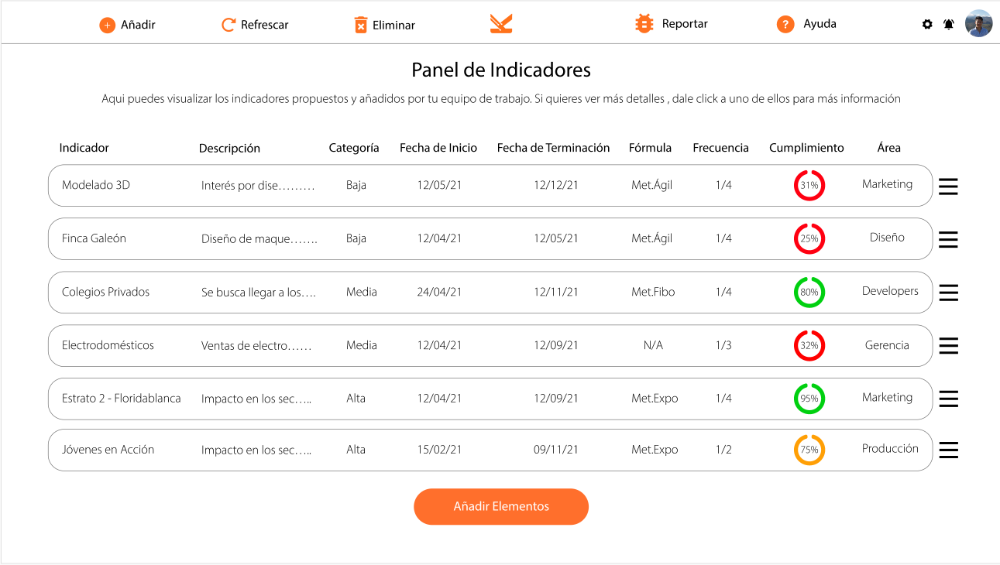
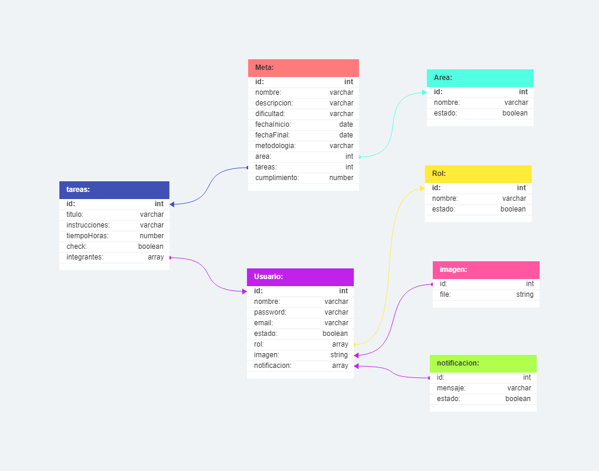

## 🕹️ Propuesta Kario Media PM (Desarrollado con MERN)

**Un desarrollador Full-Stack es solicitado en hacer la continuación del proyecto de desarrollo de un Aplicativo Web que pueda mostrar el panel de gestionamiento de proyectos y sus módulos necesarios para la empresa “Kario Media”, la cual realiza licitaciones públicas y privadas de varios nichos de negocio. El equipo de UI/UX hace una entrega formal del primer flujo de entrada para la parte administrativa, en el cual va desde su login hasta el acceso a su panel administrativo.**

**Dicho esto, el propósito de dicho trabajo es replicar la propuesta dada por parte del equipo de UI/UX y crear los módulos de “Añadir”,”Eliminar”, “Reportar”, “Ayuda” y “Perfil (Log-In y Log-Out)”, manteniendo el flujo de diseño propuesto previamente.**

 

# 💡 Objetivo

**el objetivo es construir la parte funcional del aplicativo web de acuerdo con el diseño proporcionado, permitiendo a la empresa "Kario Media" gestionar proyectos y realizar acciones específicas dentro de la aplicación. El desarrollador debe garantizar que la experiencia del usuario sea fluida y que las funcionalidades se integren de manera coherente en la interfaz de usuario.**

 

# 📋 Funcionalidades Principales

- **Gestión de Area**: En el contexto del proyecto, un "área" se refiere a una sección o departamento específico dentro de la empresa "Kario Media". Cada área puede estar relacionada con un nicho de negocio particular o una función específica dentro de la organización, como ventas, marketing, desarrollo de productos, etc. Cada área puede tener sus propios proyectos y módulos de gestión asociados en la aplicación web.

- **Gestión de Meta**: Una "meta" en este proyecto representa un objetivo o resultado deseado que la empresa "Kario Media" busca lograr mediante la gestión de proyectos y módulos en la aplicación web. Las metas pueden variar según el área y el proyecto en cuestión, y pueden incluir objetivos como el lanzamiento de un producto, la adquisición de nuevos clientes o la realización exitosa de licitaciones.

- **Gestión de Rol**: Un "rol" se refiere a la función o posición que un usuario desempeña dentro de la aplicación web. En este contexto, los roles determinan qué acciones y permisos tiene un usuario en la plataforma. Por ejemplo, pueden existir roles como "Administrador" con acceso completo a todas las funciones y datos, "Usuario Regular" con permisos limitados y "Invitado" con acceso limitado o solo de lectura.

- **Gestión de Usuario**: Un "usuario" es una persona autorizada para acceder y utilizar la aplicación web desarrollada para "Kario Media". Los usuarios pueden ser empleados de la empresa que utilizan la aplicación para gestionar proyectos y realizar tareas relacionadas con sus áreas de responsabilidad. Cada usuario tendrá un rol específico que determinará sus acciones y capacidades en la plataforma.

 

# 🖇️ Diagrama Entidad Relación

## Diagrama Entidad relacion en SQL

El Modelo entidad relacion se realizo en dbdesigner y se puede visualizar mediante el siguiente enlace [Diagrama Entidad Relación](https://dbdesigner.page.link/zab4qXaJ5ZD8S8eDA)

 

# 🎨 Diseño UIX

El diseño del proyecto se encuentra en el siguiente enlace [Designer✨]()

# Tecnologías Utilizadas

  
  
  
  
  
  
  
  
          

 

### 🖋️ Integrantes:
  - Maicol David Estrada León
  - Joel Santiago Abril Gelvez
  - Anthoni Lexandre Hernandez Diaz
  - Maria Camila Amaya Rubío
